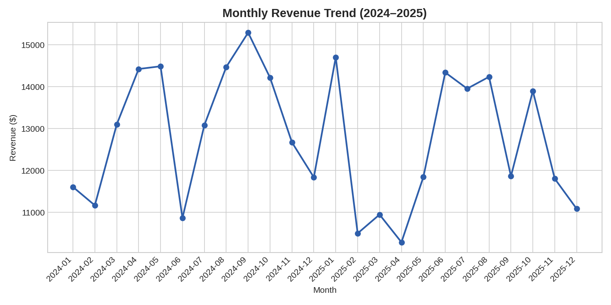
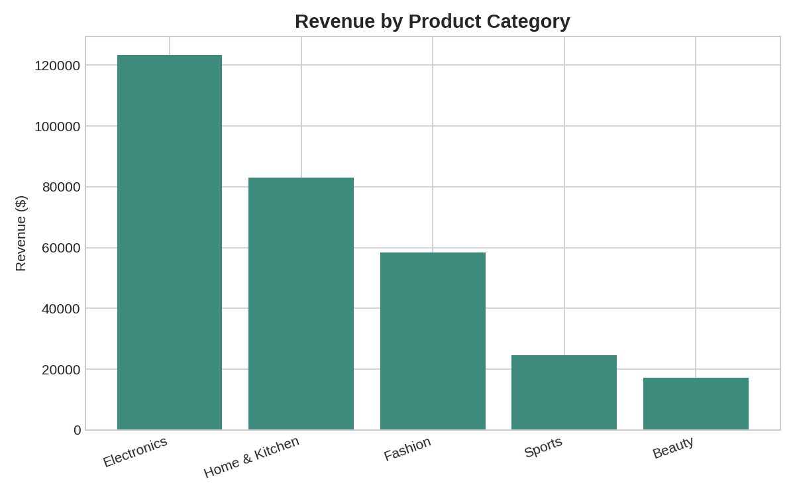
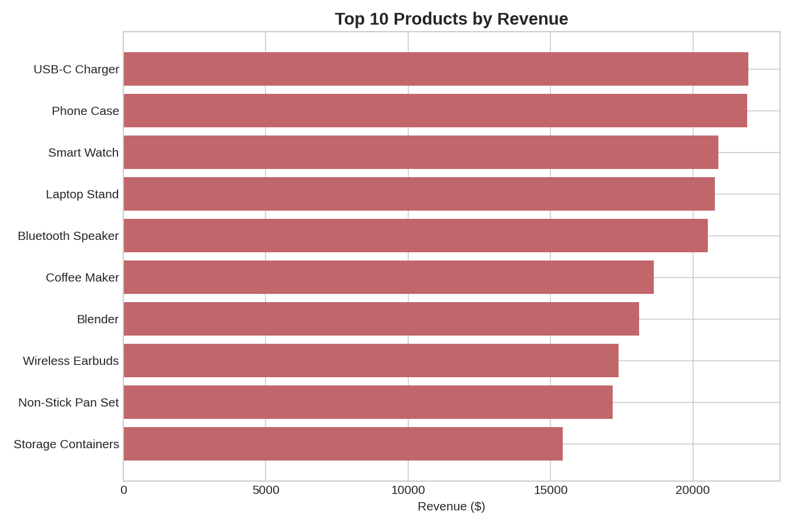

# E-Commerce Sales Analysis

A SQL + Python analysis of 3,000 e-commerce orders, uncovering revenue trends, top-performing products, customer behavior, and return patterns — with actionable recommendations for the business.

## Business Questions

1. How is revenue trending over time, and is there seasonality?
2. Which product categories and products drive the most revenue?
3. How do sales differ across regions and channels (website, app, marketplace)?
4. Are repeat customers more valuable than one-time buyers?
5. Which categories have the highest return rates?
6. Does discounting actually increase order value?

## Tools Used
- **SQL (SQLite)** — data aggregation and business logic (`analysis_queries.sql`)
- **Python (pandas, matplotlib)** — pipeline automation and visualization (`run_analysis.py`)
- **Data**: synthetically generated, realistic e-commerce order data (`ecommerce_sales.csv`)

## Key Findings

**1. Revenue is stable with a Q4/New Year lift, but no runaway growth.**
Monthly revenue hovers between $10K–$15K with a noticeable dip in early spring (Feb–Apr) both years, and a spike around September and January. This suggests seasonal marketing pushes or paydays could be timed around these months.



**2. Electronics is the clear revenue driver.**
Electronics brings in **$123K (39% of total revenue)** — more than double any other category. Within Electronics, USB-C Chargers, Phone Cases, and Smart Watches are the top 3 individual products by revenue.




**3. Repeat customers are worth 3x more than one-time buyers.**
Repeat customers spend an average of **$327.93** vs. **$104.64** for one-time buyers, and account for **~92% of total revenue** despite being ~78% of the customer base. This strongly supports investing in retention (loyalty programs, email remarketing) over pure acquisition.

**4. Website is the dominant channel everywhere, but mobile is close behind.**
Across all 5 regions, Website consistently outperforms Mobile App and Marketplace, though Mobile App is a strong #2 nearly everywhere — an opportunity for a stronger mobile-first push.

**5. Discounts don't pay for themselves here.**
Orders with **no discount averaged $106.04**, while orders with a **high discount (15–20%) averaged only $86.50** — discounting is correlating with *lower* average order value, not higher basket sizes. Worth testing whether discounts are being applied to already-lower-priced items, or whether they should be replaced with bundling offers instead.

**6. Sports products have the highest return rate (4.81%)**, notably higher than Fashion (2.87%). Worth investigating sizing/fit or product quality for that category specifically.

## Recommendations
- Double down on retention: repeat customers are the real revenue engine.
- Investigate discount strategy — it's not clearly driving bigger baskets.
- Time promotional campaigns around the Feb–Apr dip to smooth revenue.
- Audit Sports category for return drivers (sizing guide, product descriptions, QA).

## How to Reproduce
```bash
pip install pandas numpy matplotlib
python generate_data.py     # creates ecommerce_sales.csv
python run_analysis.py      # loads into SQLite, runs SQL queries, generates charts
```

## Files
| File | Description |
|---|---|
| `generate_data.py` | Generates the synthetic sales dataset |
| `ecommerce_sales.csv` | Raw order-level data (3,000 rows) |
| `analysis_queries.sql` | Standalone SQL queries used for analysis |
| `run_analysis.py` | Loads data into SQLite, runs queries, builds charts |
| `sales.db` | SQLite database (generated) |
| `chart_*.png` | Visualizations |
| `summary_*.csv` | Aggregated result tables |
